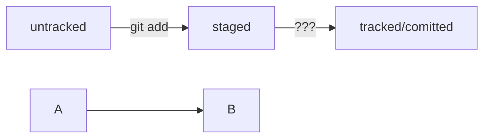

# ЧТО Я УЗНАЛА
## КОМАНДЫ:
1. **git status** - статус может быть связанным, измененным но без новых коммитов, несвязанным
2. *Типы оформлений*- общий: как следует писать коммит; для компаний; для gitHub
3. HEAD - текущий комиит

   

